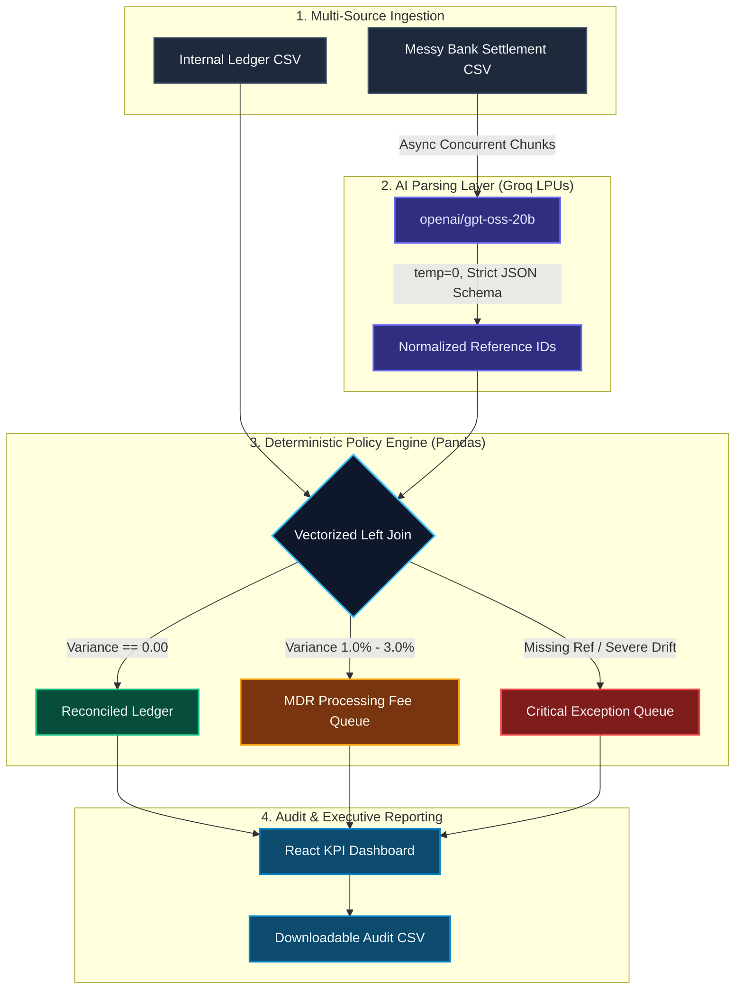
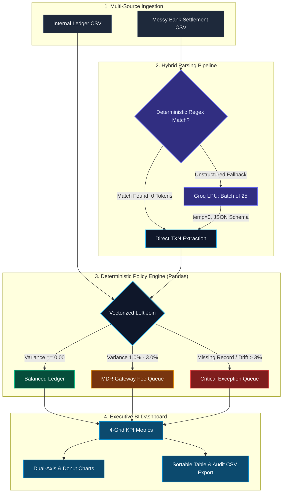

<!-- # ReconZero: Zero-Hallucination Financial Reconciliation Engine
### **Track: AI Finance Controller | Razorpay AI Buildathon 2026**

## 📌 Core Philosophy: "Accuracy Over Everything"
Financial ledgers do not tolerate hallucinations. Large Language Models (LLMs) are prone to arithmetic drift when asked to perform mathematical operations or compare decimals directly. 

**ReconZero** decouples **unstructured data parsing** from **deterministic financial reconciliation**:
1. **AI Parsing Layer:** Uses Groq LPUs (`openai/gpt-oss-20b`) with temperature `0` strictly for entity extraction from unstructured bank narrations (e.g., standardizing `UPI/REF/TXN0002/RAZORPAY` into clean JSON schema `{ "reference_id": "TXN0002" }`).
2. **Deterministic Settlement Engine:** Matches records via vectorized Pandas joins and validates exact decimal parity.
3. **Automated Exception Queue:** Distinguishes normal gateway fees (MDR 1.0%–3.0%) from critical transaction dropouts and generates an auditable review ledger.

---

## ⚙️ System Invariants
* **Zero Math in LLM:** The AI model is strictly bounded to JSON entity extraction. It is physically prohibited from calculating sums or evaluating parity.
* **Bounded Concurrency:** Ingestion uses `asyncio.Semaphore(10)` to prevent rate-limit throttling while achieving parallel sub-2-second execution.
* **Categorical Settlement Rules:** Separates anticipated merchant fees (1.0%–3.0%) from unauthorized balance slippage and payment dropouts.

---

## 🛠️ Architecture & Tech Stack
* **AI Extraction:** Groq LPUs (`openai/gpt-oss-20b`), Structured JSON Mode, Temperature `0`
* **Backend:** FastAPI, AsyncOpenAI, Pandas, Pydantic, Python-Multipart
* **Frontend:** React, Vite, Modern Dark Dashboard UI
* **Input Formats:** Internal Ledger CSV & Unstructured Bank Settlement Statement CSV

---

## 📐 System Architecture



---

## 🚀 How to Run Locally

### 1. Clone the Repository
```bash
git clone https://github.com/procoder-divyanshv/razorpay-recon-engine.git
cd razorpay-recon-engine
```

### 2. Backend Setup
```bash
cd backend
python3 -m venv venv
source venv/bin/activate
pip install fastapi uvicorn pandas pydantic openai python-multipart
export GROQ_API_KEY="your-groq-api-key"
uvicorn main:app --reload
```
*The API documentation will run interactively at `http://127.0.0.1:8000/docs`.*

### 3. Frontend Setup
Open a separate terminal window:
```bash
cd frontend
npm install
npm run dev
```
*The interface will run locally at `http://localhost:5173`.*

### 4. Running Mock Data
Generate realistic test files with simulated un-settled transfers and fee slippage:
```bash
python3 mock_data/generate_mock_data.py
```
Upload `mock_data/internal_ledger.csv` and `mock_data/bank_statement.csv` directly into the dashboard to test the pipeline. -->


# ReconZero: Zero-Hallucination Financial Reconciliation Engine

### Track: AI Finance Controller | Razorpay AI Buildathon 2026

## Core Philosophy: "Accuracy Over Everything"

Financial ledgers do not tolerate hallucinations. Large Language Models (LLMs) are prone to arithmetic drift when asked to perform mathematical operations or compare decimal balances directly. **ReconZero** decouples unstructured data parsing from deterministic financial reconciliation.

1. **Hybrid AI Parsing Layer:** Implements a sub-millisecond regex fast-path for standard banking identifiers, automatically falling back to Groq LPUs (`openai/gpt-oss-20b`) in batches of 25 for unstructured narrations. Operates strictly at `temperature: 0` for entity extraction into typed schemas.
2. **Deterministic Settlement Engine:** Matches ledger and bank statements via vectorized Pandas joins to evaluate exact decimal parity without LLM intervention.
3. **Automated Exception & MDR Triage:** Discrepancies are categorized into predictable Payment Gateway fees (MDR 1.0%–3.0%), un-settled transaction dropouts, and unexplained revenue drift for human audit.

## Key Enterprise Features

* **Hybrid Fast-Path Parsing:** Bypasses LLM calls for structured narrations using instant regex evaluation, slashing token consumption and eliminating HTTP latency.
* **Batch Token Optimization:** Chunks irregular narrations into 25-item batches per API request, cutting API calls by up to 96% and preventing `429 Rate Limit Exceeded` throttling.
* **Smart Gateway Fee (MDR) Auditing:** Flags expected 1.5%–2.5% merchant discount rates separately from outright missing funds to eliminate false alarms.
* **Dual-Axis Financial Analytics:** Visualizes transaction volume against variance loss using an interactive dual-axis composed chart (Bar + Line) and composition donut charts.
* **Executive Ops Experience:** Full-screen responsive layout, dynamic Light/Dark mode, tabbed navigation (Ingestion vs. Results), 1-click demo data loading, drag-and-drop CSV ingestion, live search, variance severity sorting, and audit CSV exports.

## System Invariants

* **Zero Math in LLM:** The AI model is strictly bounded to JSON entity extraction. It is physically prohibited from calculating sums or validating parity.
* **Zero-Token Fast-Path:** Standard bank identifiers are resolved locally in Python (0ms, 0 tokens). The LLM is invoked only as an intelligent fallback.
* **Deterministic Matching:** Settlements are resolved strictly through vectorized joins against primary reference keys (`transaction_id`) and floating-point comparisons.
* **Idempotent Audit Queue:** Operations do not overwrite balances. Exceptions are routed to an exportable review queue with operational guidance tags.

## Architecture & Tech Stack

* **AI Extraction:** Groq LPUs (`openai/gpt-oss-20b`), Structured JSON Mode, Temperature `0`
* **Backend:** FastAPI, AsyncOpenAI, Pandas, Pydantic, Python-Multipart
* **Frontend:** React, Vite, Recharts, Lucide React, Full-Screen Fluid CSS
* **Input Formats:** Internal Ledger CSV & Unstructured Bank Settlement Statement CSV

## System Architecture



## How to Run Locally

### 1. Clone the Repository
```bash
git clone https://github.com/procoder-divyanshv/razorpay-recon-engine.git
cd razorpay-recon-engine
```

### 2. Backend Setup
```bash
cd backend
python3 -m venv venv
source venv/bin/activate
pip install fastapi uvicorn pandas pydantic openai python-multipart
export GROQ_API_KEY="your-groq-api-key"
uvicorn main:app --reload
```
The interactive Swagger API documentation will run at `http://127.0.0.1:8000/docs`.

### 3. Frontend Setup
Open a separate terminal window:
```bash
cd frontend
npm install
npm install recharts lucide-react
npm run dev
```
The dashboard interface will run at `http://localhost:5173`.

### 4. Running Mock Data & One-Click Demo
Generate 100 realistic records with simulated merchant fee slippage, payment dropouts, and varying bank narrations:
```bash
python3 mock_data/generate_mock_data.py
```
1. Open `http://localhost:5173`.
2. Click **Load Demo Data** on the Ingestion Pipeline tab (or drag-and-drop the generated CSVs).
3. Click **Run Reconciliation Engine** to view the live KPIs, dual-axis charts, and exception ledger.
