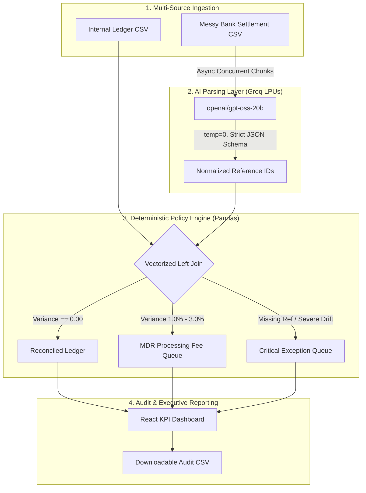

# ReconZero: Zero-Hallucination Financial Reconciliation Engine
### **Track: AI Finance Controller | Razorpay AI Buildathon 2026**

## 📌 Core Philosophy: "Accuracy Over Everything"
Financial ledgers do not tolerate hallucinations. Large Language Models (LLMs) are prone to arithmetic drift when asked to perform mathematical operations or compare decimals directly. 

**ReconZero** decouples **unstructured data parsing** from **deterministic financial reconciliation**:
1. **AI Parsing Layer:** Uses Groq LPUs (`openai/gpt-oss-20b`) with temperature `0` strictly for entity extraction from unstructured bank narrations (e.g., standardizing `UPI/REF/TXN0002/RAZORPAY` into clean JSON schema `{ "reference_id": "TXN0002" }`).
2. **Deterministic Settlement Engine:** Matches records via vectorized Pandas joins and validates exact decimal parity.
3. **Automated Exception Queue:** Distinguishes normal gateway fees (MDR 1.0%–3.0%) from critical transaction dropouts and generates an auditable review ledger.

---

## ⚙️ System Invariants
* **Zero Math in LLM:** The AI model is strictly bounded to JSON entity extraction. It is physically prohibited from calculating sums or evaluating parity.
* **Bounded Concurrency:** Ingestion uses `asyncio.Semaphore(10)` to prevent rate-limit throttling while achieving parallel sub-2-second execution.
* **Categorical Settlement Rules:** Separates anticipated merchant fees (1.0%–3.0%) from unauthorized balance slippage and payment dropouts.

---

## 🛠️ Architecture & Tech Stack
* **AI Extraction:** Groq LPUs (`openai/gpt-oss-20b`), Structured JSON Mode, Temperature `0`
* **Backend:** FastAPI, AsyncOpenAI, Pandas, Pydantic, Python-Multipart
* **Frontend:** React, Vite, Modern Dark Dashboard UI
* **Input Formats:** Internal Ledger CSV & Unstructured Bank Settlement Statement CSV

---

## 📐 System Architecture



---

## 🚀 How to Run Locally

### 1. Clone the Repository
```bash
git clone https://github.com/procoder-divyanshv/razorpay-recon-engine.git
cd razorpay-recon-engine
```

### 2. Backend Setup
```bash
cd backend
python3 -m venv venv
source venv/bin/activate
pip install fastapi uvicorn pandas pydantic openai python-multipart
export GROQ_API_KEY="your-groq-api-key"
uvicorn main:app --reload
```
*The API documentation will run interactively at `http://127.0.0.1:8000/docs`.*

### 3. Frontend Setup
Open a separate terminal window:
```bash
cd frontend
npm install
npm run dev
```
*The interface will run locally at `http://localhost:5173`.*

### 4. Running Mock Data
Generate realistic test files with simulated un-settled transfers and fee slippage:
```bash
python3 mock_data/generate_mock_data.py
```
Upload `mock_data/internal_ledger.csv` and `mock_data/bank_statement.csv` directly into the dashboard to test the pipeline.
